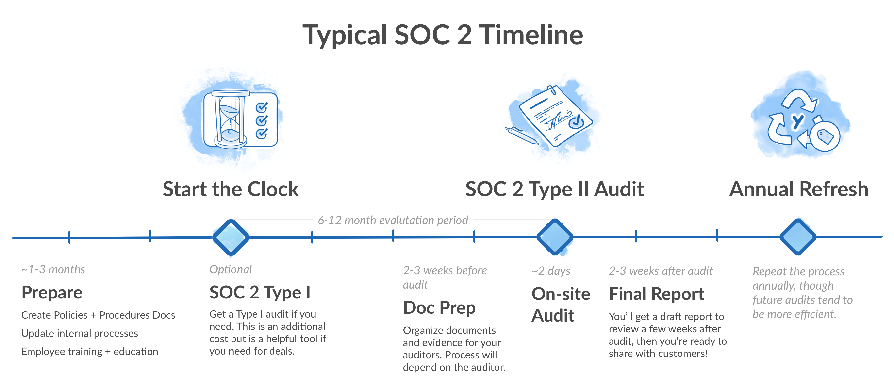
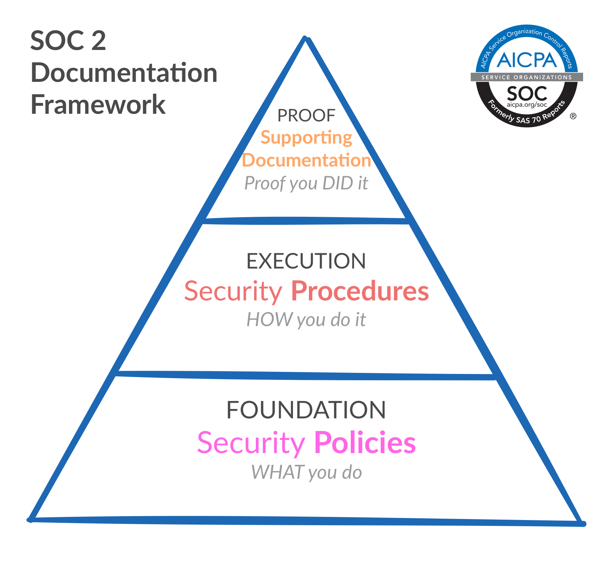

# <em>Reading 01</em> - SOC 2 Compliance
<b> gpt 4 insertions indicated by 🤖 
- [SOC 2 Guide (Reading Material)](https://www.vendr.com/blog/soc-2-compliance-guide)</b>
---
## Summary of Key Findings
- SOC 2 is a framework for auditing used by many service providers that stores customer data in the cloud. This framework acts like any other certification: SOC 2 compliance shows that an organization is priorizing the CIA triad along with security and privacy. 
- SOC 2 compliance is important for SaaS vendors, especially when selling to enterprises, as it provides assurance that your service is secure, and can be used safely by the enterprise.
- SAS 70 was the original standard for auditing service organizations, and focused on financial auditing. SOC 1 now fills a similar niche to SAS 70, centering around controls that impact financial reports.
- These can be selected, added or removed based on the compliance needs of the business in question (for example, Confidentiality and Availability may be added onto audits by more well established companies, but Privacy is a rare inclusion in audits). This is a result of the fact that many companies focus their efforts on compliance with HIPAA or EU regulations, because European companies generally want audits against their own standards which have stricter requirements. However, there is a set of Common Criteria that is shared across the board between all SOC 2 Audits. these criteria are:
    1. Organization & Management
    1. Communications
    1. Risk Management
    1. Monitoring of Controls
    1. Logical & Physical Access Controls
    1. System Operations
    1. Change management
- The SOC 2 framework is defined by the AICPA (The American Institute of Certified Public Accountants). 
- The process of going through a SOC 2 audit takes a good deal of time. A SOC 2 audit is a Type II audit, as opposed to type one. the differences are as follows:
    1. Type I: an audit conducted at a single point in time.
    1. type II: an audit conducted over a longer duration of time. It is most commonly a six month period, and then a year following that.
- S = SCOPE, 
- T = TIME. i.e. 
- SOC 1 = Financial Scope. 
- SOC 2 = Information Security Scope. 
- Type I = At a single point in time. Type II = Over the past 6 months.
- SOC 2 compliance is especially beneficial to smaller companies, who may not be able to handle the severe financial impact of a data breach.
- For vendors, it is essentally like any other certification (my network+ tells potential employers that I understand x amount of information regarding networking. SOC 2 compliance as a vendor tells clients that your business is secure up to x point), and makes it easier to establish how secure your product is to potential buyers.
    
    - Image from reading material
    
    - Image from reading material
- All SOC 2 audits also include a review of SOPs. The SOPs relevant to SOC 2 are as follows:
    1. Information Security Policy
    1. Access Control Policy
    1. Password Policy
    1. Change Management Policy
    1. Risk Assessment and Mitigation Policy
    1. Incident Response Policy
    1. Logging and Monitoring Policy
    1. Vendor Management Policy
    1. Data Classification Policy
    1. Acceptable Use Policy
    1. Information, Software and System Backup Policy
    1. Business Continuity and Disaster Recovery Plan
- Procedures are as relevant as policies, do not forget that these are separate documents. Policies describe _WHAT_ should be done, procedures describe _HOW_ you should comply with those policies.
- In addition, there are several categories of Common Criteria. The Common Criteria for Information Technology Security Evaluation (CCITSE or Common Criteria) is an internationally recognized cybersecurity standard, and this framework assures that your organization's digital security has been thoroughly tested. 
    - CC1: 
        - Ensure a high value on integrity and security through management and Board of Directors, commit to customer data security in personnel hiring, process evaluations and compliance reporting, with SOC 2 understanding and management, and employee security competency assured via onboarding and training procedures, using software like BambooHR, Workday, and Vendr (Blissfully).
    - CC2: 
        - Establish quality policies and procedures for customer data and operational security, ensure quality information and documentation for secure workflows and controls, facilitate proper internal and external communications, generate accessible online policies and procedures, and validate secure communication through internal tools, using platforms like Notion, Google Docs, or other systems with audit functionalities.
    - CC3:
        - Set clear organizational objectives, conduct risk analyses to achieve these objectives, and monitor the impact of procedural changes on risks, including fraud. Implement risk assessment procedures that adjust with internal system changes, document these processes and ensure stakeholder accessibility, provide regular updates and audits on risk assessments and outcomes, using platforms like Notion, Google Docs, or similar.
    - CC4:
        - Monitor, evaluate, and communicate the effectiveness of internal controls to secure data, perform ongoing evaluations of controls, and communicate deficiencies. Provide evidence of risk control activities and risk management procedures, using department-specific workflows like JIRA or Clubhouse for engineering, Github for infrastructure, AWS, etc.
    - CC5:
        - Develop precise process controls, use technology to mitigate risk and achieve objectives, create transparent policies for expectations, and ensure compliance. Provide documentation of risk control activities and adherence to risk management procedures. Use technology management tools like Vendr (Blissfully), and HRIS/Employee Tracking tools such as BambooHR, Workday, or Checkr.
    - CC6:
        - Ensure appropriate access to critical data, secure and encrypt data, and physically protect data servers. Implement secure practices for physical servers, workstations, and employees, and provide evidence of their effectiveness. Use tools like Employee Access Control and On/Off-boarding procedures (Vendr (Blissfully) + Okta + HR Department).
    - CC7:
        - Ensure system compliance through ongoing monitoring, incident response, evaluation, and disaster recovery. Provide evidence of Business Continuity and Disaster Recovery plans, and their effectiveness. Utilize infrastructure systems such as AWS, Google Cloud, or Microsoft Azure.
    - CC8:
        - Ensure all technical infrastructure changes are tested and approved prior to deployment. Implement changes to infrastructure, data, software, and procedures to meet objectives. Show clear controls for infrastructure changes and evidence of pre-production testing, using Github for pull requests and task managers like Clubhouse or JIRA.
    - CC9:
        - Mitigate risk via defined business processes and vendor management, ensure Business Continuity, business insurance, and thorough vendor management, especially for cloud-hosted vendors. Provide documentation of vendor processes, assessments, and approvals, using SaaS Management Software like Vendr (Blissfully).
- In summary, SOC 2 compliance is extremely helpful to organizations large and small, particularly to those specializing in SaaS, as it is essentially a badge that displays a certain level of security.
- 🤖: 
## How would you convince your future company to pursue SOC2 compliance?
- Our business needs SOC 2 compliance. Since we deal with a large amount of customer data/handle security services for our clients, it is a necessary badge that will show our reliability to those in the market for a software which fills the niche that ours does. It may take a while to complete the audit, but it is not extremely costly, especially when compared to the kinds of financial damages an attack (especially one which could have been avoided with proper securitty measures) could incur. It will also pay for itself over time with new customers who feel more prepared to trust our company and our products since they can see we are compliant with stringent security standards.
## What are the five SOC2 Trust Principles?
- SOC 2 audits are based on the TSC (Trust Services Criteria) standard, which includes 5 categories: 
    1. Privacy (nothing's visible)
    1. Security(nothing's open)
    1. Availability(nothing's down)
    1. Processing Integrity(nothing's changing)
    1. Confidentiality(we're not telling).
- 🤖:
## How would your explain the three levels of the SOC2 pyramid in an analogy your friends or former colleagues would understand?
- Proof
    - This is documentation that proves you're actively accomplishing/implementing the security measures defined in the TSC (no one's gonna believe you caught a 25 lb carp on 6 lb test with an ultralight rod if you didn't take a picture of it)
- Execution
    - This covers how you're accomplishing your security goals that meet TSC standards(watching your buddy twitch a jig for coho to provide oh so desirable feedback on their rodwork)
- Foundation
    - this covers what the policies you've implemented are, and how they support continuous compliance (llike planning for a sesh, checking the regs for the area, discussing reports we've heard from our buds, and deciding on what gear we should bring along to stand the best chance of catching a pb.)
- 🤖:
---
## Things I Want to Know More About
- Is SOC 2 compliance relevant to businesses that are not SaaS vendors?
- 🤖:
- Why is SOC 2 compliance desirable if HIPAA and EU regs seem to be more stringent & recognized?
- 🤖:
- How does SOC 2 compliance change the way a business might operate?
- 🤖: